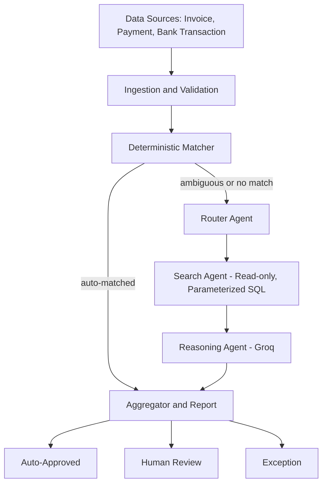
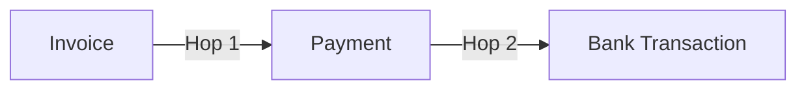
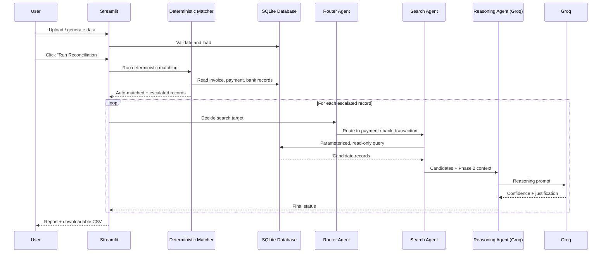

# AuditAgent — AI Finance Controller

<p align="center">


</p>

---

# 1. Overview

AuditAgent is a multi-source finance reconciliation system that closes a real finance-ops loop: matching **invoices**, **UPI payments**, and **bank transactions** against each other to verify which ones genuinely settle — and honestly reporting which ones don't.

Unlike a single LLM pass over every record, this application uses a **two-phase hybrid design**: a fast, deterministic matcher (pure pandas, zero LLM cost) resolves the easy majority instantly, and an **Agentic workflow powered by LangGraph** only picks up the records that are genuinely ambiguous — deciding what to search for, querying the database through locked-down read-only tools, and reasoning about whether it found a real match.

The project integrates **LangGraph**, **LangChain**, **Groq**, **SQLAlchemy + SQLite**, and **Streamlit** to deliver bulk reconciliation, single-record verification, and a conversational Settlement Q&A assistant — all grounded in the same real, staged data.

> Verification capacity, not generation speed, is the actual bottleneck in finance ops. This project is built around that idea.

---

# 2. Features

- 📥 Generate synthetic test data, or upload your own invoice / payment / bank transaction data (CSV, XLSX, or a single multi-sheet Excel workbook)
- ⚡ Deterministic matching engine — reference, amount, date, and text scoring with proper one-to-one assignment (correctly catches duplicate candidates)
- 🤖 LangGraph agent chain — router → search → reasoning, only for records the deterministic pass couldn't resolve
- 🔒 Read-only, parameterized search tools — no open-ended SQL, no injection surface, tested against adversarial data
- 📊 Categorized exception reporting — every unresolved record has a plain-English reason, not a silent failure
- 🔍 Verify any single invoice on demand, with full transparency into the agent's reasoning
- 💬 Settlement Q&A chat assistant, grounded in the real staged data
- 🖥️ Dark-mode, multi-page Streamlit interface
- 📄 Downloadable CSV report

---

# 3. System Architecture



The reconciliation relationship itself is two hops:



An invoice only counts as **fully reconciled** once both hops are confidently linked.

---

# 4. Workflow



---

# 5. Tech Stack

| Category | Technologies |
|----------|--------------|
| Language | Python |
| Agent Framework | LangGraph |
| Tool Calling | LangChain |
| LLM | Groq (`openai/gpt-oss-120b`) |
| Database | SQLite + SQLAlchemy |
| Data Handling | pandas |
| File I/O | openpyxl |
| UI | Streamlit |
| Environment | Python Virtual Environment |

---

# 6. Installation

Clone the repository

```bash
git clone https://github.com/Uttam15n/AuditAgent.git

cd AuditAgent
```

Create virtual environment

```bash
python -m venv venv
```

Activate

Windows

```bash
venv\Scripts\activate
```

Linux / Mac

```bash
source venv/bin/activate
```

Install dependencies

```bash
pip install -e ".[agents]"
```

---

# 7. Environment Variables

Create a `.env` in the project root

```text
GROQ_API_KEY=
```

Get a free key at [console.groq.com](https://console.groq.com).

---

# 5. Run Application

```bash
streamlit run app/streamlit_app.py
```

Or run the full pipeline standalone, no UI, straight to console:

```bash
python run_full_pipeline.py
```

---

## 6. How It Works

The system follows a **deterministic-first, agent-assisted reconciliation pipeline**:

```text
┌─────────────────────────────────────────────────────────────┐
│  1. UPLOAD / GENERATE DATA                                  │
│                                                             │
│  Upload invoices, payments, or bank transactions —          │
│  or generate a synthetic test batch.                        │
└──────────────────────────────┬──────────────────────────────┘
                               ↓
┌─────────────────────────────────────────────────────────────┐
│  2. VALIDATE & STAGE                                        │
│                                                             │
│  Input data is schema-validated and staged into SQLite      │
│  for consistent and reliable processing.                    │
└──────────────────────────────┬──────────────────────────────┘
                               ↓
┌─────────────────────────────────────────────────────────────┐
│  3. DETERMINISTIC MATCHING                                  │
│                                                             │
│  Every possible pair is scored using:                       │
│    • Reference / ID match                                   │
│    • Amount match                                           │
│    • Date proximity                                         │
│    • Text similarity                                        │
│                                                             │
│  A global one-to-one assignment resolves the batch          │
│  instead of making independent record-level decisions.      │
└──────────────────────────────┬──────────────────────────────┘
                               ↓
                    ┌──────────────────────┐
                    │ Confidently resolved?│
                    └──────────┬───────────┘
                         YES ↙     ↘ NO
                            ↓       ↓
                 ┌──────────────┐   ┌─────────────────────────┐
                 │ AUTO-APPROVED│   │ 4. AGENT ESCALATION     │
                 └──────────────┘   │                         │
                                    │ Unresolved records are  │
                                    │ passed to the LangGraph │
                                    │ agent chain.            │
                                    └────────────┬────────────┘
                                                 ↓
┌─────────────────────────────────────────────────────────────┐
│  5. AGENTIC INVESTIGATION                                   │
│                                                             │
│  Router Agent                                               │
│       ↓                                                     │
│  Identifies what information is missing                     │
│       ↓                                                     │
│  Search Agent                                               │
│       ↓                                                     │
│  Queries SQLite using read-only, parameterized tools        │
│       ↓                                                     │
│  Reasoning Agent (Groq)                                     │
│       ↓                                                     │
│  Determines the final outcome, confidence score,            │
│  and plain-English justification.                           │
└──────────────────────────────┬──────────────────────────────┘
                               ↓
┌─────────────────────────────────────────────────────────────┐
│  6. FINAL CLASSIFICATION & REPORTING                        │
│                                                             │
│  Every record is assigned to exactly one outcome:           │
│                                                             │
│     ✓ Auto-Approved     ⚠ Human Review    ✕ Exception      |
│                                                             │
│  Results are compiled into a downloadable reconciliation    │
│  report with the decision, confidence, and reasoning.       │
└─────────────────────────────────────────────────────────────┘
```

### Processing Philosophy

**Deterministic first → Agentic reasoning only when needed**

The system does not send every record to an LLM. Straightforward matches are resolved using deterministic scoring, while only ambiguous or unresolved cases are escalated to the agentic workflow. This keeps the reconciliation process **efficient, explainable, and controlled**.


# 7. Security Design

The agent chain never has open-ended database access:

- **Three fixed, parameterized tools only** — `search_by_reference`, `search_by_amount_range`, `search_by_date_range`. The LLM never writes raw SQL.
- **Whitelisted tables and columns**, checked before any query is built.
- **Parameterized values, always** — SQL injection is structurally impossible, not just discouraged.
- **A genuinely read-only database connection** — opened via `mode=ro` at the SQLite driver level.
- **Prompt-injection tested** — the reasoning agent is instructed to treat any free-text field as untrusted data, never instructions, and this was verified against records deliberately containing injected commands.

---

# 8. Screenshots

> Add your own screenshots here after running the app locally — save them into a `docs/screenshots/` folder and reference them below.

## Dashboard


---

## Reconciliation Dashboard


---

## Reconciliation Report


---

## Chat Assistant


---
# 9. Author

**Uttam N**

Final Year Computer Science (Cyber Security)

Passionate about

- Software Engineering
- Artificial Intelligence
- Generative AI
- Agentic AI Systems
- Large Language Models

---

